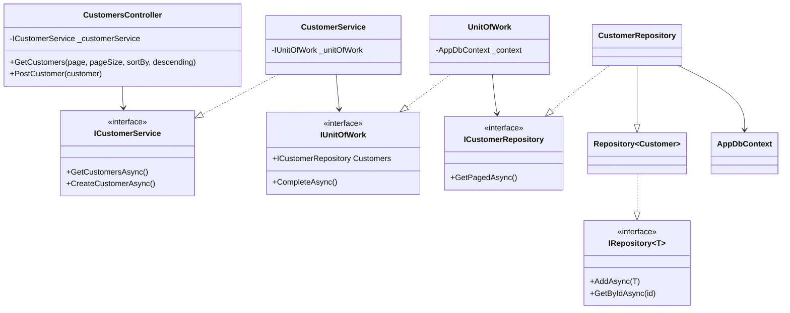
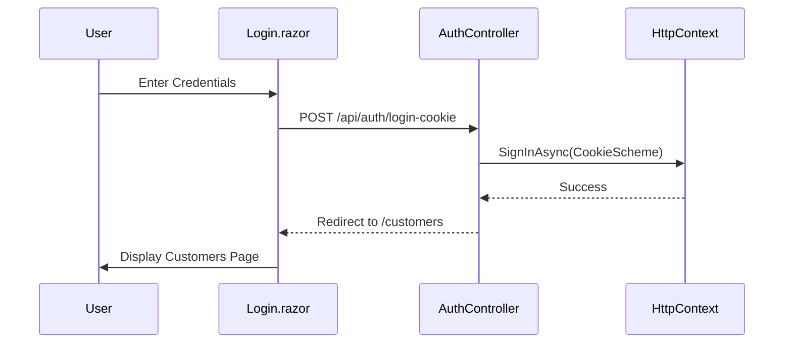
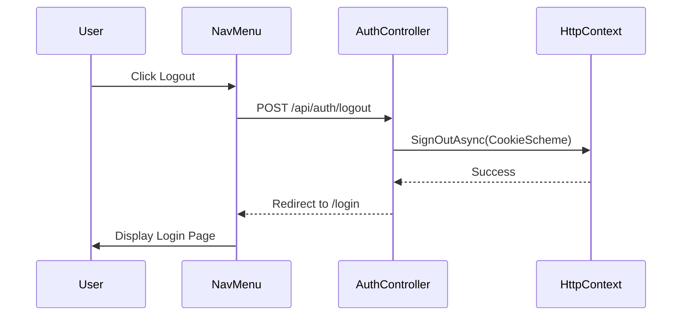
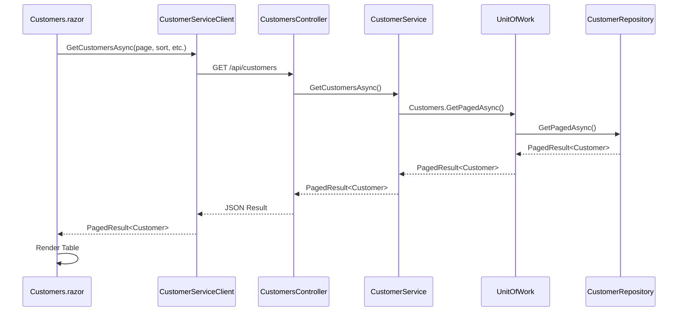
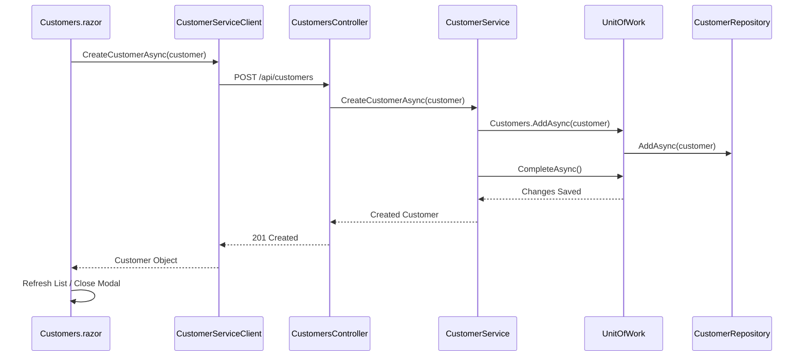
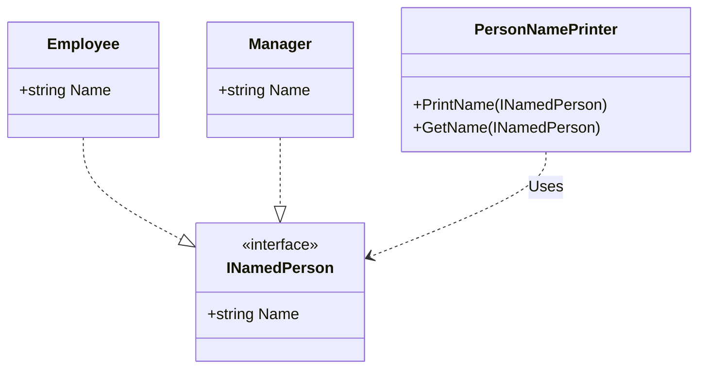
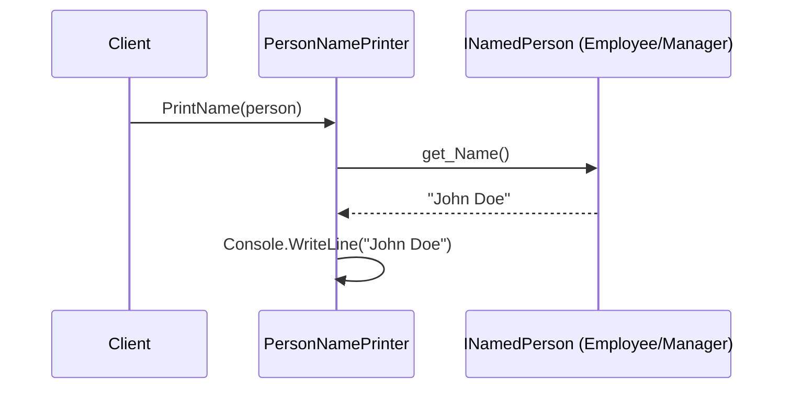

# Description

1. 	You are given a solution that contains a Blazor Web App with a Customer model class.

	You should fork this project and provide a github link for your solution.

	You have to develop 

	Required: 
	- A grid with all customers with paging
	- CRUD Operations on “Customer” model with new, edit and delete functionalities
	- Expose all CRUD Operations as an API 
	- Configure application to use Sql Server
	- Manage migrations
	- Add Cookie authentication for the client  
	- Protect your API with JWT authentication
	
	Nice to have :
	- Blazor UI framework
	- Unit & Integration Tests
2. Below are the two classes Employee and Manager. Your task is to create a method in a new class that takes either Manager or an Employee as a parameter and prints its name.

	```
	public class Employee
	{
		public string Name { get; set; }
	}
	
	public class Manager
	{
		public string Name { get; set; }
	}
	```

## Requirements 

- C#
- .NET 9+ 
- Blazor Interactive (wasm or server render mode)

## Solution Description

### Part 1: Customer Management System
- **Architecture**: Implemented using a Clean Architecture approach with a multi-project solution structure:
  - `EpsilonWebApp.Shared`: Shared models and interfaces.
  - `EpsilonWebApp.Data`: Entity Framework Core implementation, Repositories, and Unit of Work.
  - `EpsilonWebApp`: ASP.NET Core API host and Blazor Server-side components.
  - `EpsilonWebApp.Client`: Blazor WebAssembly client.
- **Patterns**: Followed SOLID principles, utilizing the **Repository** and **Unit of Work** patterns to decouple business logic from data access.
- **UI/UX**: 
  - Developed a responsive Blazor WASM grid with server-side paging and dynamic sorting.
  - Integrated **OpenStreetMap Nominatim API** for real-time address autocomplete and auto-population of city, postal code, and country.
  - Fully translated the UI into Greek.
- **Security**: Implemented a hybrid authentication system using **JWT** for API protection and **Cookie Authentication** for the Blazor UI.
- **Database**: Configured for **SQL Server** with automated migrations.
- **Testing**: Included **xUnit** tests for the API controllers and services.

### Part 2: SOLID Principles Implementation
- Refactored `Employee` and `Manager` classes to implement a common `INamedPerson` interface, adhering to the **Liskov Substitution Principle**.
- Developed `PersonNamePrinter` which depends on the interface (**Dependency Inversion Principle**), allowing it to handle any future "named person" types without modification (**Open/Closed Principle**).

## Assumptions
- **Database**: The solution assumes a local SQL Server instance is running and accessible with the credentials provided in `appsettings.json` (`User Id=sa;Password=Sp#r0s1994!`).
- **Authentication**: For the purpose of this challenge, the `AuthController` uses a simplified login check. In a production environment, this would be integrated with ASP.NET Core Identity or an external provider.
- **Internet Connectivity**: Real-time address validation requires an active internet connection to reach the OpenStreetMap Nominatim API.
- **Environment**: The application is configured to run on `http://localhost:5234` by default.

## Diagrams

### Class Diagram - Part 1 (System Architecture)


### Sequence Diagram - Login Flow


### Sequence Diagram - Logout Flow


### Sequence Diagram - Populate Customer List


### Sequence Diagram - Add New Customer


### Part 2 - SOLID Principles
#### Class Diagram


#### Sequence Diagram

