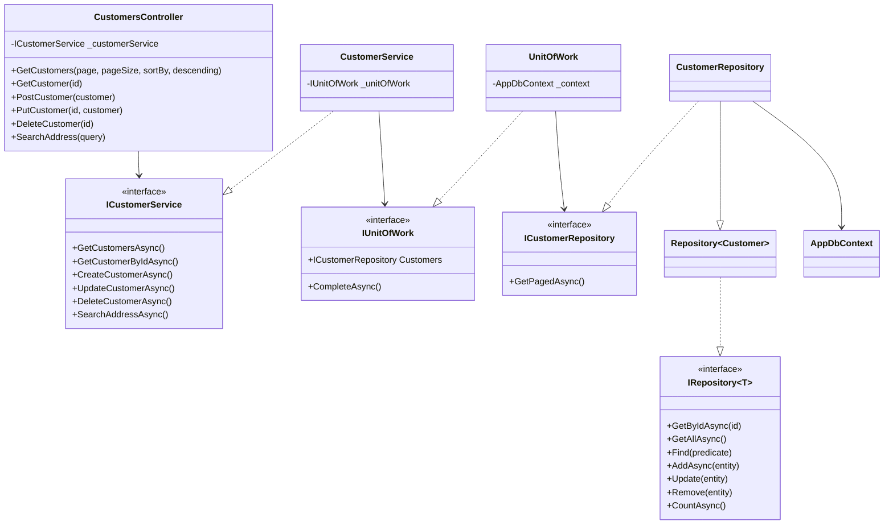
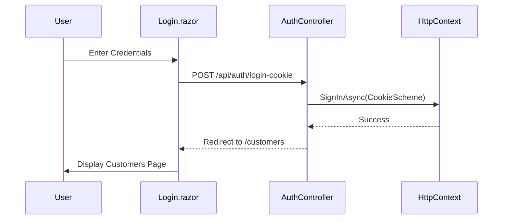
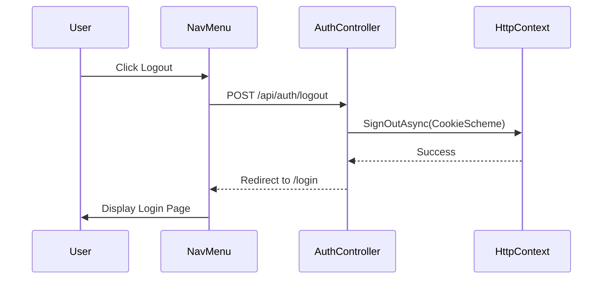
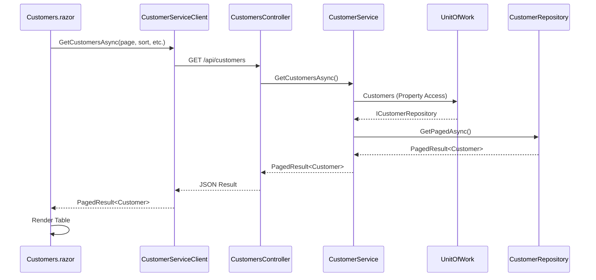
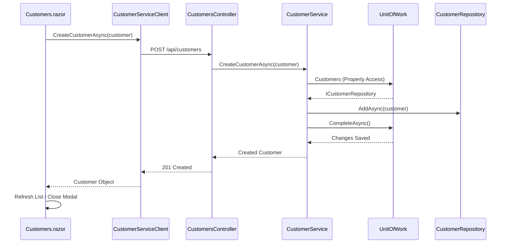
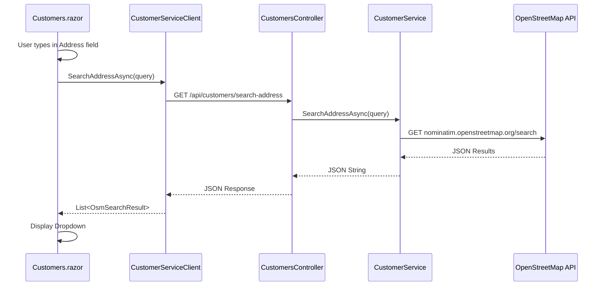
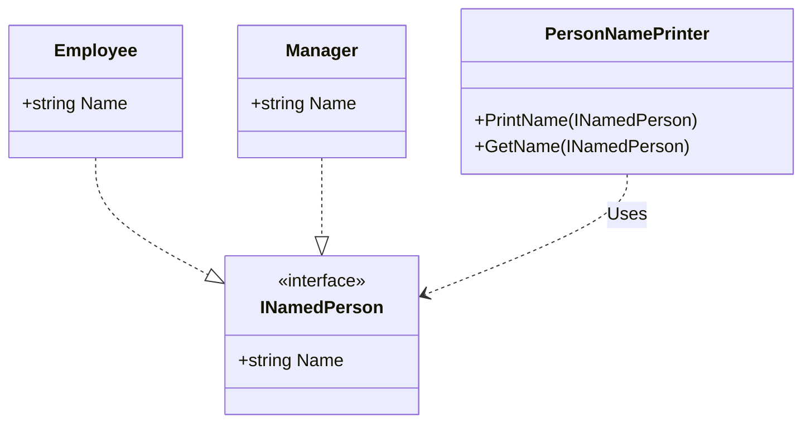
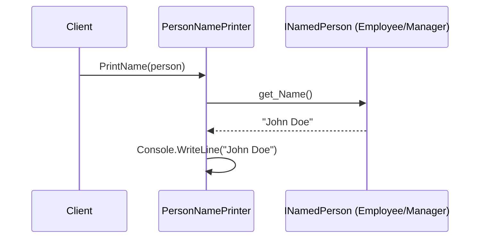

# Description

1. 	You are given a solution that contains a Blazor Web App with a Customer model class.

	You should fork this project and provide a github link for your solution.

	You have to develop 

	Required: 
	- A grid with all customers with paging
	- CRUD Operations on “Customer” model with new, edit and delete functionalities
	- Expose all CRUD Operations as an API 
	- Configure application to use Sql Server
	- Manage migrations
	- Add Cookie authentication for the client  
	- Protect your API with JWT authentication
	
	Nice to have :
	- Blazor UI framework
	- Unit & Integration Tests
2. Below are the two classes Employee and Manager. Your task is to create a method in a new class that takes either Manager or an Employee as a parameter and prints its name.

	```
	public class Employee
	{
		public string Name { get; set; }
	}
	
	public class Manager
	{
		public string Name { get; set; }
	}
	```

## Requirements 

- C#
- .NET 9+ 
- Blazor Interactive (wasm or server render mode)

## Solution Description

### Part 1: Customer Management System
- **Architecture**: Implemented using a **Clean Architecture** approach with a multi-project solution structure:
  - `EpsilonWebApp.Shared`: Shared models, DTOs, and common interfaces.
  - `EpsilonWebApp.Data`: Persistence layer using **Entity Framework Core**, featuring the **Repository** and **Unit of Work** patterns.
  - `EpsilonWebApp`: ASP.NET Core **API Host and Service Proxy**. It handles authentication, API routing, and proxies external service calls (OpenStreetMap), acting as the backend bridge for the Blazor client.
  - `EpsilonWebApp.Client`: Blazor WebAssembly frontend.
- **Blazor Interactivity**: 
  - Implemented using **Interactive WebAssembly (WASM)** render mode for the Customer management interface.
  - **Prerendering was disabled** (`prerender: false`) for the `Customers.razor` page. This ensures that the client-side authentication and API calls (via `CustomerServiceClient`) work correctly from the start without the "flicker" or double-initialization issues often encountered when combining prerendering with client-side API dependencies.
- **Patterns**:
  - **SOLID Principles**: Applied throughout the codebase to ensure maintainability and testability.
  - **Repository Pattern**: Abstracted data access to keep the domain logic decoupled from EF Core specifics.
  - **Unit of Work**: Managed transactions and repository orchestration.
  - **Service Layer**: Introduced `ICustomerService` to encapsulate business logic, keeping controllers thin and focused on HTTP concerns.
  - **Dependency Injection**: Utilized for loose coupling between components.
- **Scalability (Millions of Customers/Users)**: 
    - The solution is designed to handle large-scale data sets by utilizing **Database Indexing** on all frequently sorted and searched columns (CompanyName, ContactName, City, etc.) in `AppDbContext`.
    - **Read-Only Optimizations**: The `CustomerRepository` uses `.AsNoTracking()` for all fetch operations to minimize memory overhead and improve performance when reading millions of records.
    - **Pagination**: Implemented server-side pagination to ensure that only small, manageable chunks of data are ever loaded into memory or transmitted over the network.
    - **Architectural Readiness**: While advanced optimizations like Redis caching, rate limiting, and keyset pagination were considered, they were intentionally omitted to maintain a clean, readable codebase appropriate for the challenge scope, while ensuring the fundamental database-level performance foundations are in place.
    - **Scalability Testing**: Added a dedicated test suite (`ScalabilityPerformanceTests.cs`) that verifies pagination logic with large volumes, ensures sorting correctness across indexed columns, and validates the use of `AsNoTracking()` to reduce memory footprint.
- **UI/UX**: 
  - Developed a responsive Blazor WASM interface using the **QuickGrid** component for displaying customer data with server-side paging and dynamic sorting.
  - Integrated **OpenStreetMap Nominatim API** for real-time address autocomplete and auto-population of city, postal code, and country.
  - Fully translated the UI into Greek, including a custom Greek paginator for the QuickGrid.
- **Security**: Implemented a **Hybrid Authentication** system:
  - **Cookie Authentication**: For the Blazor Web UI (stateful session management).
  - **JWT (JSON Web Token)**: For programmatic API access and external clients (stateless).
- **Database**: Configured for **SQL Server** with automated migrations.
- **Testing**:
  - **Unit Testing**: Implemented using **xUnit** and **Moq** for service and logic isolation.
  - **Component Testing**: Leveraged **bUnit** for testing Blazor components, ensuring correct UI rendering and event handling.
  - **Integration & E2E Testing**: Used **Microsoft Playwright** (with **NUnit**) for full end-to-end user flow verification, including login, CRUD operations, and address autocomplete validation.
  - **Data Layer Testing**: Utilized **Microsoft.EntityFrameworkCore.InMemory** for testing repository logic and controller interactions without a physical SQL Server requirement.

### Part 2: SOLID Principles Implementation
- Refactored `Employee` and `Manager` classes to implement a common `INamedPerson` interface, adhering to the **Liskov Substitution Principle**.
- Developed `PersonNamePrinter` which depends on the interface (**Dependency Inversion Principle**), allowing it to handle any future "named person" types without modification (**Open/Closed Principle**).

## Assumptions
- **Database**: The solution assumes a local SQL Server instance is running. The implementation was developed and tested using a **MSSQL Docker container** with the following configuration:
  ```bash
  docker run --name mssql -p 1433:1433 -e ACCEPT_EULA=Y -e MSSQL_SA_PASSWORD=Sp#r0s1994! -e MSSQL_PID=Developer --restart unless-stopped -v D:/Volumes/mssql/data:/var/opt/mssql/data -v D:/Volumes/mssql/log:/var/opt/mssql/log -v D:/Volumes/mssql/shared:/Shared -d mcr.microsoft.com/mssql/server:2022-latest
  ```
  **Why Docker?**: I intentionally avoided using **SQL Server LocalDB** because it is tightly coupled with Visual Studio. As I prefer using **VS Code** for development, Docker provides a more portable and platform-independent environment. Furthermore, I generally prefer using Docker for infrastructure services—including databases, publish-subscribe brokers (like RabbitMQ or Redis), and monitoring/logging/alerting stacks (like ELK or Prometheus/Grafana)—as it ensures consistency across development, testing, and production environments.

  The connection details (Host, Database Name, User, and Password) are managed in `appsettings.json`. Additionally, the following script was used inside **SQL Server Management Studio (SSMS)** to populate the database with 100 sample customer records.

  **Note on Seeding**: An external SQL script was chosen over built-in Entity Framework Core seeding (`HasData`) for several reasons:
  - **Migration Hygiene**: Built-in seeding bloats migration files with large amounts of static data, making them harder to review and manage.
  - **Efficiency**: The SQL script utilizes Common Table Expressions (CTEs) and built-in SQL functions (`NEWID()`, `CHOOSE`, `MAXRECURSION`) to generate 100 unique, high-quality sample records (with mixed Greek and International data) much more efficiently than procedural C# code.
  - **Flexibility**: A script allows for a clean "TRUNCATE and Repopulate" workflow during development and testing without requiring application restarts or migration changes.

  The complete SQL population script can be found in [SQLSCRIPT.md](./SQLSCRIPT.md).
- **Authentication**: For the purpose of this challenge, the `AuthController` uses a simplified login check. In a production environment, this would be integrated with ASP.NET Core Identity or an external provider.
- **Internet Connectivity**: Real-time address validation requires an active internet connection to reach the OpenStreetMap Nominatim API.
- **Environment**: The application is configured to run on `http://localhost:5234` by default.
- **Microservices Approach**: A microservices architecture was intentionally avoided in favor of a **Modular Monolith** with a Clean Architecture structure. This decision was made because:
  - **Complexity**: Microservices introduce significant overhead in terms of deployment, inter-service communication, and distributed tracing that is not justified by the current project scope.
  - **Performance**: In-memory function calls within a single process are faster and simpler than network calls (REST/gRPC) between distributed services.
  - **Maintainability**: The current multi-project structure provides sufficient separation of concerns (Shared, Data, API, Client) while keeping the codebase easy to manage for a small team.
  - **Cost**: A monolithic deployment is more cost-effective and easier to orchestrate than a cluster of independent containers.

## Diagrams

### Class Diagram - Part 1 (System Architecture)


### Sequence Diagram - Login Flow


### Sequence Diagram - Logout Flow


### Sequence Diagram - Populate Customer List


### Sequence Diagram - Add New Customer


### Sequence Diagram - Address Search (Service Proxy)


### Part 2 - SOLID Principles
#### Class Diagram


#### Sequence Diagram

